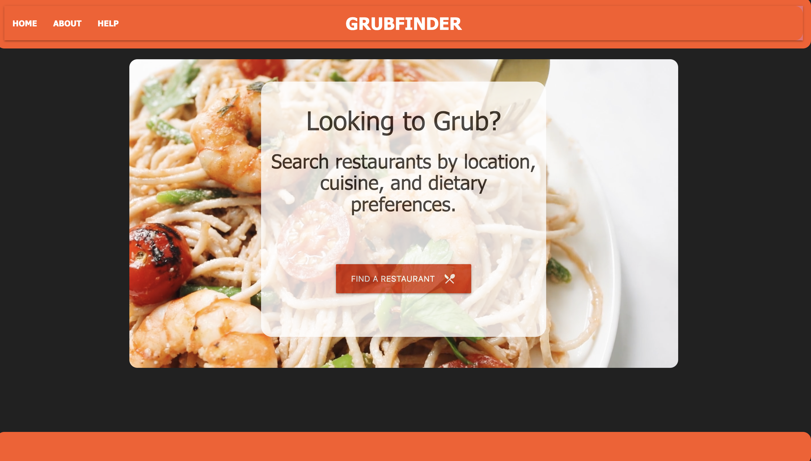
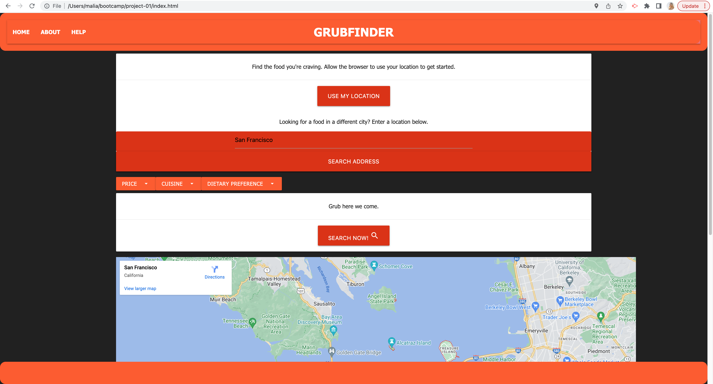

# GRUBFINDER
Group 3 Project 01 UCBFSF

## Description

With Grubfinder, employees can quickly search for restaurants in the area, filter results by cuisine type, diet, price, and ratings, and view information about each restaurant, including its location, menu, and hours of operation. They can also read reviews from other users and see photos of the restaurant and its dishes. This will save us time and hassle, and help our employees find great restaurants for lunch that they will enjoy.
### User Story
```
AS a busy professional,
I WANT to be able to quickly and easily find a good restauraunt for lunch near my office
SO THAT I can find the perfect place to eat.
I WANT to be able to filter my results by cuisine type, price, and ratings
SO THAT I can find restaurants that meet my preference.
```
### Acceptance Criteria
```
GIVEN that I am a busy proffessional looking for lunch near my office
WHEN I go to the GRUBFINDER website and enter my location
THEN I am presented with a list of restaurants near my office.
WHEN I click on a specific restaurant from the list
THEN I am presented with detailed information about the restaurant, including its location,menu, and hours of operation
WHEN I filter the results by cuisine type/diet, price, and ratings
THEN I should be presented with a list of restaraunts that match my preferences
WHEN I resize the page or view the site on various screens and devices
THEN I am presented with a responsive layout that adapts to my viewport
```

## Table of Contents
1. [Installation](#installation)
2. [Usage](#usage)
3. [License](#license)
4. [Badges](#badges)
5. [Features](#features)
6. [Contributing](#contributing)

## Installation
No Install Needed. You can access the webpage through the link below.

https://jbxamora.github.io/deployedapp

## Usage
To use GRUBFINDER, simply visit the website and enter your location. You will be presented with a list of restaurants near your current location. You can use the filters on the second page to narrow down your search based on cuisine type, price, and ratings. You can also click on a specific restaurants to view more detailed information, including its location, menu, hours of operation.
#### Homepage

Navigate through the webpage directly from the homepage. You can go directly to the resturaunt search by clicking on the 'FIND A RESTAURANT' button. You can also use the NavBar to checkout our about section. Alternitavely if there are any issues with the website you can check out the help page and ask for assistance from a GRUBFINDER team member.



#### Search

We've made it easy to view restaurants in your area. Using geolocation data collected from your system we can display a list of restaraunts in your area. Alternitavely you can search from an address, city , or state. Its up to you to search where you want!



### Contact Form

I went down a deep rabbit hole with this project. To showcase that I've implemented a working contact form. The contact form recieves information from the website and then sends it to a google sheet I set up. This wasn't entirely my idea but it bothered me that I built a contact form that did not serve it's purpose.


This is the most advanced feature on my webpage.

## Code Snippets

### Contact Form

Here is the script I used to connect my contact form to my google sheets. Once I created my Sheet, I went into the appscript extension and inputted this code. Once I deployed the app I was ready to take in contact information from readers.

```js
var sheetName = 'Sheet1'
var scriptProp = PropertiesService.getScriptProperties()

function intialSetup () {
  var activeSpreadsheet = SpreadsheetApp.getActiveSpreadsheet()
  scriptProp.setProperty('key', activeSpreadsheet.getId())
}

function doPost (e) {
  var lock = LockService.getScriptLock()
  lock.tryLock(10000)

  try {
    var doc = SpreadsheetApp.openById(scriptProp.getProperty('key'))
    var sheet = doc.getSheetByName(sheetName)

    var headers = sheet.getRange(1, 1, 1, sheet.getLastColumn()).getValues()[0]
    var nextRow = sheet.getLastRow() + 1

    var newRow = headers.map(function(header) {
      return header === 'timestamp' ? new Date() : e.parameter[header]
    })

    sheet.getRange(nextRow, 1, 1, newRow.length).setValues([newRow])

    return ContentService
      .createTextOutput(JSON.stringify({ 'result': 'success', 'row': nextRow }))
      .setMimeType(ContentService.MimeType.JSON)
  }

  catch (e) {
    return ContentService
      .createTextOutput(JSON.stringify({ 'result': 'error', 'error': e }))
      .setMimeType(ContentService.MimeType.JSON)
  }

  finally {
    lock.releaseLock()
  }
}
```

For a more thoughrough explaination here is where I found the script:
https://github.com/jamiewilson/form-to-google-sheets

### Hover

Throughout the webpage the one psuedo class I utelized the most was :hover. You can see it in use on almost all the sections of the site from the navbar to Contact Form. Here is an example of that.

```css
.work {
    border-radius: 10px;
    position: relative;
    overflow: hidden;
}

.work img {
    width: 100%;
    border-radius: 10px;
    display: block;
    transition: transform 0.7s;
}

```

Renders this:


## License

MIT License

Copyright (c) [2022] [Jorge Zamora]

Permission is hereby granted, free of charge, to any person obtaining a copy
of this software and associated documentation files (the "Software"), to deal
in the Software without restriction, including without limitation the rights
to use, copy, modify, merge, publish, distribute, sublicense, and/or sell
copies of the Software, and to permit persons to whom the Software is
furnished to do so, subject to the following conditions:

The above copyright notice and this permission notice shall be included in all
copies or substantial portions of the Software.

THE SOFTWARE IS PROVIDED "AS IS", WITHOUT WARRANTY OF ANY KIND, EXPRESS OR
IMPLIED, INCLUDING BUT NOT LIMITED TO THE WARRANTIES OF MERCHANTABILITY,
FITNESS FOR A PARTICULAR PURPOSE AND NONINFRINGEMENT. IN NO EVENT SHALL THE
AUTHORS OR COPYRIGHT HOLDERS BE LIABLE FOR ANY CLAIM, DAMAGES OR OTHER
LIABILITY, WHETHER IN AN ACTION OF CONTRACT, TORT OR OTHERWISE, ARISING FROM,
OUT OF OR IN CONNECTION WITH THE SOFTWARE OR THE USE OR OTHER DEALINGS IN THE
SOFTWARE.

## Badges


## Features

1. 
2. 
3. 
4. 
5. 
6. 
7. 
8. 
9. 
10. 

## Contributing
Pull requests are welcome. For major changes, please open an issue first to discuss what you would like to change. If the issue goes unresolved for more than a week feel free to contact us on the GRUBFINDER website.

